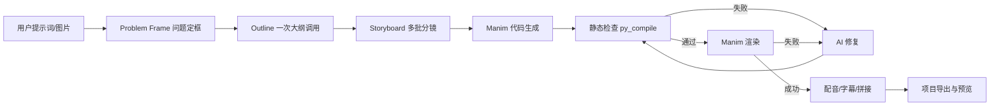

# Manim 教学动画生成器架构说明

## 当前定位

本项目第一版是 Windows 本地桌面软件：Electron 负责界面，FastAPI/Python 负责 AI 编排、Manim 渲染、字幕、配音和项目导出。

架构参考 ManimCat 的 Workflow/Builder 思路，但做成本地桌面版本：

- 保留直接生成模式，适合用户点击生成后快速得到视频。
- 引入问题定框、阶段清单、事件日志、静态检查和修复闭环。
- 不按具体知识点写死模板，避免“提示词是中国却复用沈阳素材”这类问题。
- 后续可以扩展 Studio/Agent 模式，用同一套 pipeline 记录和项目产物。

## 主流程

## ManimCat 工作程序的本地化

本项目现在按 ManimCat 的工作程序拆成更明确的阶段：

1. Problem Framing：先固定当前任务，不让后续阶段重新猜主题。
2. Concept / Visual Design：把分镜整理成可执行视觉设计稿，写入 `visual_design.md`。
3. Code Generation：代码必须忠实执行 storyboard 和 visual design，不能重新发明画面。
4. Static Guard：渲染前先做 `py_compile`，如果本机安装了 `mypy`，再做可选类型/名称检查。
5. Visual Guard：检查旧主题素材、数学占位图、坐标轴/向量模板是否误入当前主题。
6. Repair Loop：失败时把错误、当前代码、教学目标、分镜 visual_plan 一起发给模型，最多修复 3 轮。
7. Render / Stitch / Export：渲染片段，拼接，写最终项目产物。

这套程序的目的不是让软件只会生成固定模板，而是让每个主题都先形成自己的可视化设计，再由代码生成阶段忠实实现。

## 从 ManimCat 借鉴并本地化的部分

### 1. Problem Frame

每个任务先写入 `problem_frame.json`，记录：

- 用户提示词摘要；
- 是否上传图片；
- 提示词和图片冲突时的优先级；
- 目标时长；
- 渲染质量；
- 是否启用紧凑节奏。

这一步的作用是让后续 AI 调用围绕同一目标展开，而不是每轮都重新猜任务。

### 2. Pipeline Recorder

每个项目目录新增：

- `pipeline_manifest.json`：阶段状态、耗时、完成/失败情况；
- `pipeline_events.jsonl`：追加式事件日志，便于定位失败点。

当前阶段包括：

- `prepare`
- `outline`
- `storyboard`
- `codegen`
- `static_check`
- `render_course`
- `repair`
- `stitch`
- `export`

### 3. 静态检查优先于渲染

Manim 渲染前先运行 `py_compile`：

- 语法错误会直接写入 `logs/static_check_*.json`；
- 不启动 Manim，不等待完整渲染失败；
- 静态错误会进入同一套修复闭环；
- 可以减少无效渲染和无效模型重试。

后续可以继续加入更强的检查，例如：

- 禁用 ManimGL API；
- 检查过大字体、屏幕外对象和空白等待；
- 检查主题内容是否和用户提示词一致；
- 对代码做局部 AST 规则校验。

### 4. 形式 Skill，而不是内容模板

不能把“沈阳、中国、B 站、悬索桥”写成固定模板。正确方向是按教学表达形式组织能力：

- 静态对比；
- 动态演示；
- 步骤拆解；
- 关联探索；
- 分层剖析；
- 情境图示。

每个主题都应先由 AI 生成分镜和视觉计划，再选择适合的表达形式。这样软件才能解释任意主题，而不是只会生成少数对象。

## 代码边界

- `backend/ai/`：模型配置、路由、提示词、结构化输出。
- `backend/services/generation_service.py`：生成任务编排。
- `backend/pipeline/`：问题定框、阶段清单、事件记录。
- `backend/rendering/`：Manim 渲染、代码清洗、静态检查、视觉一致性守卫。
- `backend/services/tts_service.py`：语音合成与音视频混流。
- `backend/image_nodes/`：图像节点接口预留。
- `electron/`：桌面界面与本地 API 调用。

## 下一步建议

1. 增加“形式 Skill”选择器：由大纲阶段自动判断每批分镜适合哪种表达形式。
2. 增加视觉一致性检查：检测是否复用了上个主题的城市/向量/矩阵等资产。
3. 增加渲染后抽帧评估：检查标题、主题词、主要视觉对象是否匹配当前提示词。
4. 增加失败样本库：同类错误下次优先走本地规则修复，少调用模型。
