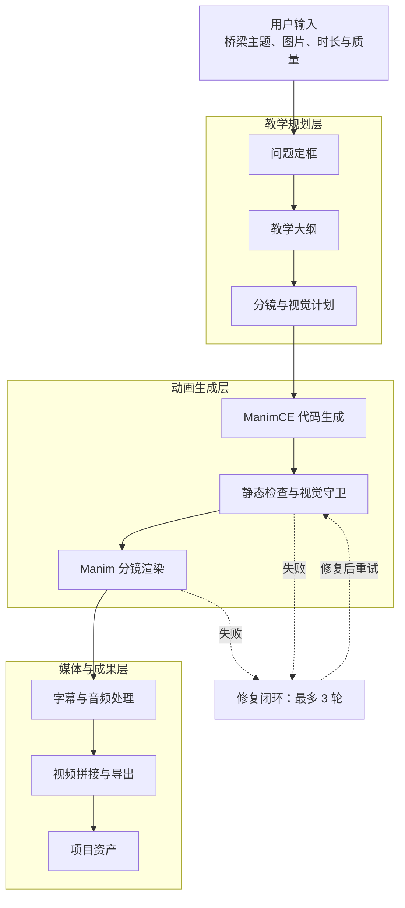
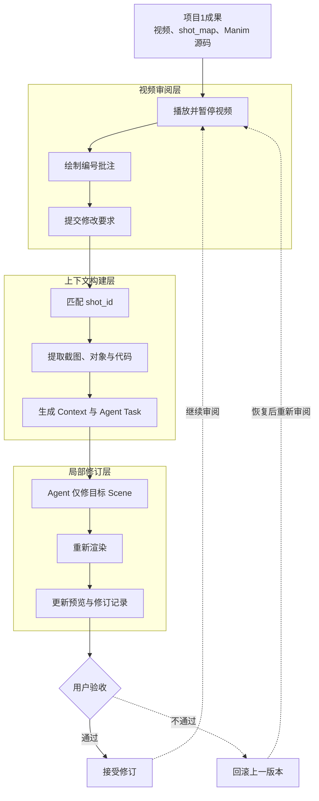

# 项目1：桥梁工程教学动画生成端

```mermaid
flowchart TB
    U["用户输入<br/>桥梁主题、图片、时长与质量"]
    subgraph P["教学规划层"]
        F["问题定框"] --> O["教学大纲"] --> S["分镜与视觉计划"]
    end
    subgraph G["动画生成层"]
        C["ManimCE 代码生成"] --> Q["静态检查与视觉守卫"] --> R["Manim 分镜渲染"]
    end
    subgraph M["媒体与成果层"]
        A["字幕与音频处理"] --> V["视频拼接与导出"] --> D["项目资产"]
    end
    E["修复闭环：最多 3 轮"]
    U --> F
    S --> C
    R --> A
    Q -. 失败 .-> E
    R -. 失败 .-> E
    E -. 修复后重试 .-> Q
```

# 项目2：视频交互审阅与局部迭代端

```mermaid
flowchart TB
    I["项目1成果<br/>视频、shot_map、Manim 源码"]
    subgraph R["视频审阅层"]
        V["播放并暂停视频"] --> A["绘制编号批注"] --> S["提交修改要求"]
    end
    subgraph C["上下文构建层"]
        M["匹配 shot_id"] --> X["提取截图、对象与代码"] --> T["生成 Context 与 Agent Task"]
    end
    subgraph P["局部修订层"]
        E["Agent 仅修目标 Scene"] --> G["重新渲染"] --> F["更新预览与修订记录"]
    end
    U{"用户验收"}
    OK["接受修订"]
    RB["回滚上一版本"]
    I --> V
    S --> M
    T --> E
    F --> U
    U -->|通过| OK
    U -. 不通过 .-> RB
    OK -. 继续审阅 .-> V
    RB -. 恢复后重新审阅 .-> V
```
