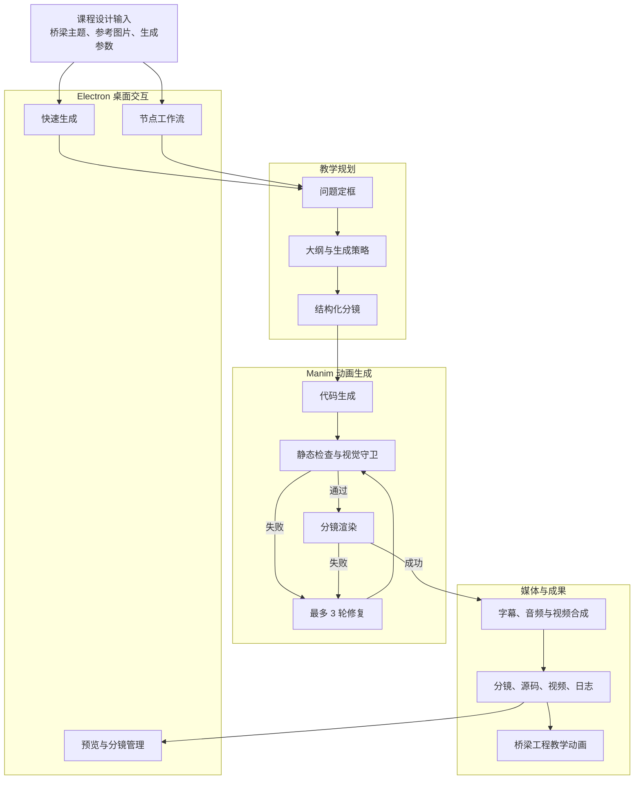
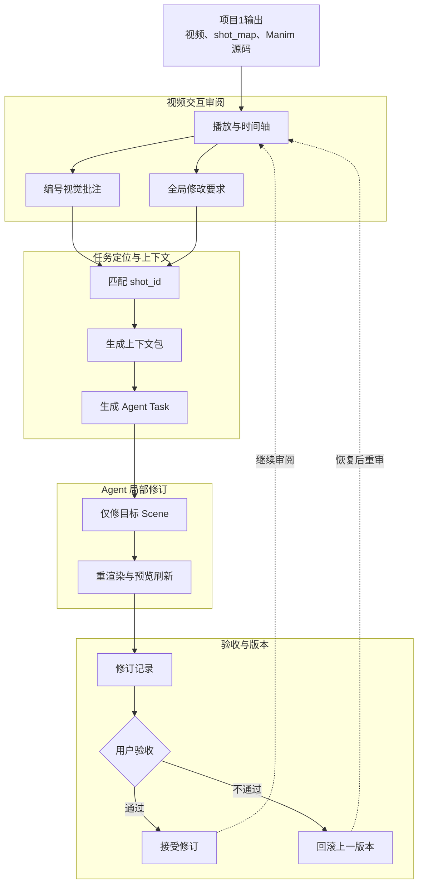

# 项目1与项目2架构流程图

## 项目1：Manim 桥梁工程教学动画生成端

```mermaid
flowchart TB
    U["课程设计输入<br/>桥梁主题、参考图片、生成参数"]
    subgraph UI["Electron 桌面交互"]
        Q["快速生成"]
        W["节点工作流"]
        P["预览与分镜管理"]
    end
    subgraph PLAN["教学规划"]
        F["问题定框"]
        O["大纲与生成策略"]
        S["结构化分镜"]
    end
    subgraph BUILD["Manim 动画生成"]
        C["代码生成"]
        G["静态检查与视觉守卫"]
        R["分镜渲染"]
        X["最多 3 轮修复"]
    end
    subgraph MEDIA["媒体与成果"]
        M["字幕、音频与视频合成"]
        A["分镜、源码、视频、日志"]
        E["桥梁工程教学动画"]
    end
    U --> Q
    U --> W
    Q --> F
    W --> F
    F --> O --> S --> C --> G
    G -->|"通过"| R
    G -->|"失败"| X --> G
    R -->|"失败"| X
    R -->|"成功"| M --> A --> E
    A --> P
```

## 项目2：Manim 视频交互审阅与局部迭代端

```mermaid
flowchart TB
    I["项目1输出<br/>视频、shot_map、Manim 源码"]
    subgraph REVIEW["视频交互审阅"]
        V["播放与时间轴"]
        N["编号视觉批注"]
        U["全局修改要求"]
    end
    subgraph CONTEXT["任务定位与上下文"]
        S["匹配 shot_id"]
        C["生成上下文包"]
        T["生成 Agent Task"]
    end
    subgraph PATCH["Agent 局部修订"]
        A["仅修目标 Scene"]
        R["重渲染与预览刷新"]
    end
    subgraph VERSION["验收与版本"]
        D["修订记录"]
        Y{"用户验收"}
        OK["接受修订"]
        RB["回滚上一版本"]
    end
    I --> V
    V --> N
    V --> U
    N --> S
    U --> S
    S --> C --> T --> A --> R --> D --> Y
    Y -->|"通过"| OK
    Y -->|"不通过"| RB
    OK -. 继续审阅 .-> V
    RB -. 恢复后重审 .-> V
```
